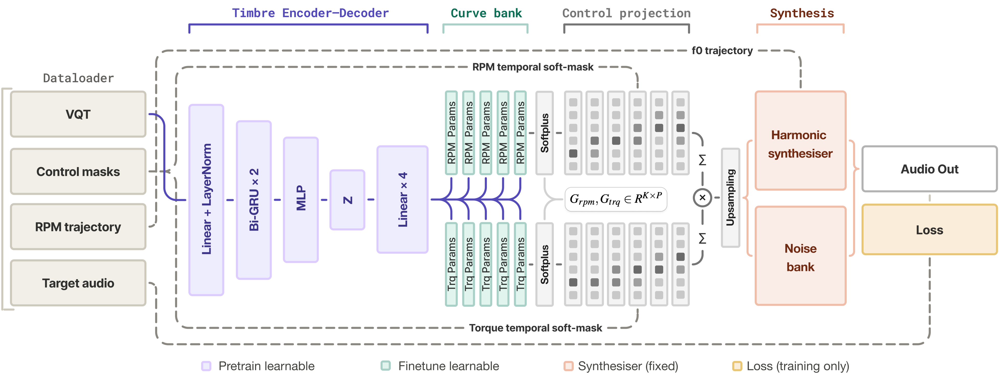

# Gradient-Based Learning of Parametric Engine Sound Representations for Real-Time Resynthesis and Tuning on Embedded Systems

**Robin Doerfler · Matthieu Kuntz · Clemens Zimmer**  
AES 2026 International Conference on Automotive Audio — Detroit, MI, July 29–31, 2026

---

### [→ Audio Examples Page](https://rdoerfler.github.io/eone-model-page/)

---

## Abstract

Engine order enhancement is central in automotive sound design, where selective harmonics are synthesized to shape perceptual qualities such as sportiness, refinedness, or power. This paper investigates a neural network-based approach to combustion engine sound modeling that extends conventional engine order analysis and enhancement by deriving synthesis parameters from audio data with machine learning and incorporating stochastic components into the synthesis framework. The system parameterizes engine sounds as a compact representation capturing per-order and broadband timbral variation across the full RPM–torque operating range, while remaining manually tunable and compatible with established automotive audio frameworks. The approach leverages gradient-based optimization and analysis-by-synthesis through an end-to-end differentiable implementation. The resulting synthesis parameter set is directly transferable to conventional DSP implementations for deployment on embedded targets. Spectral metrics and listening tests confirm high reconstruction fidelity, and integration into an established automotive audio development platform (*EVx Suite*) demonstrates technical feasibility on deployment-ready embedded systems.

## Model Overview

Input audio is provided as VQT spectrograms and encoded to a compact latent timbre representation, before being decoded into RPM and torque gain curves that form the shared parametrization for end-to-end training and direct DSP export at inference. Gain curves are projected onto temporal soft-masks to yield time-varying amplitude envelopes, which drive a differentiable harmonic synthesizer (f₀ derived from the RPM trajectory) and an ERB noise bank. Training minimizes a combined multi-resolution STFT and harmonic loss against the target audio.
